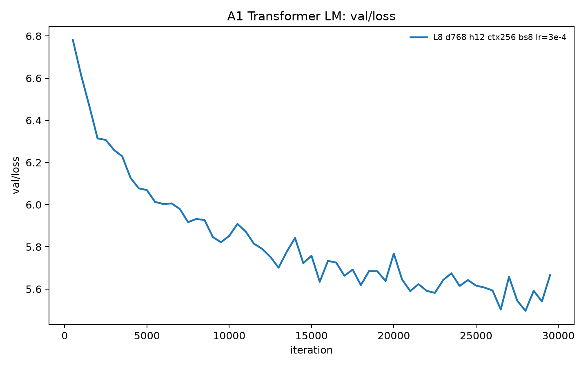
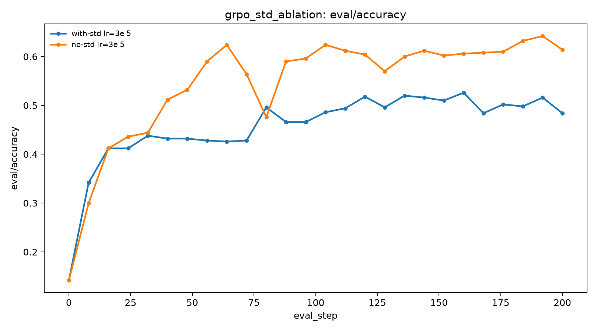
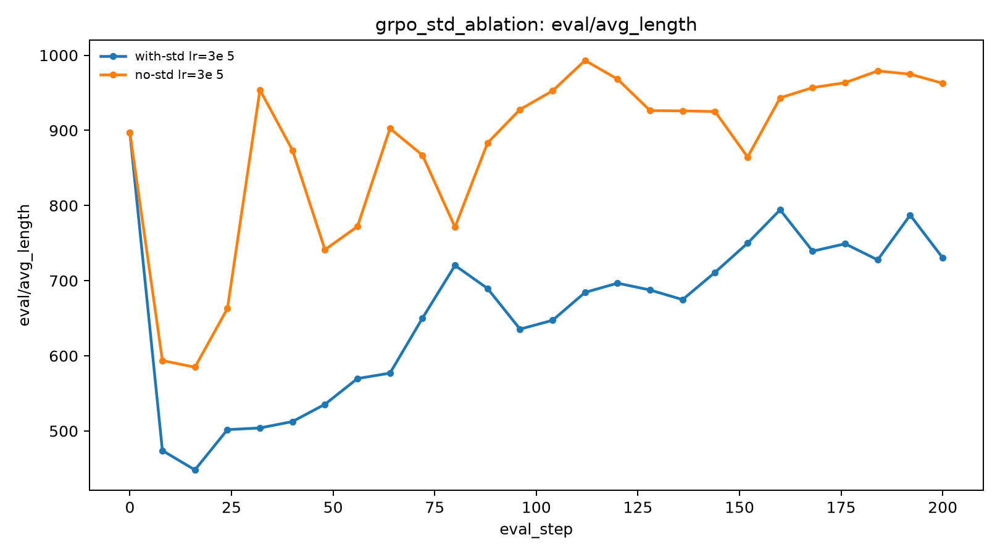
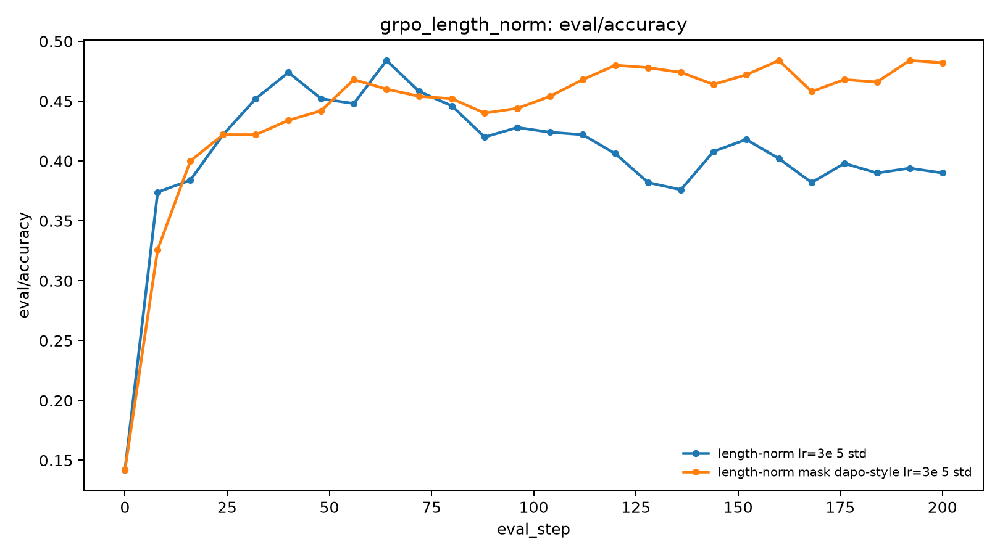
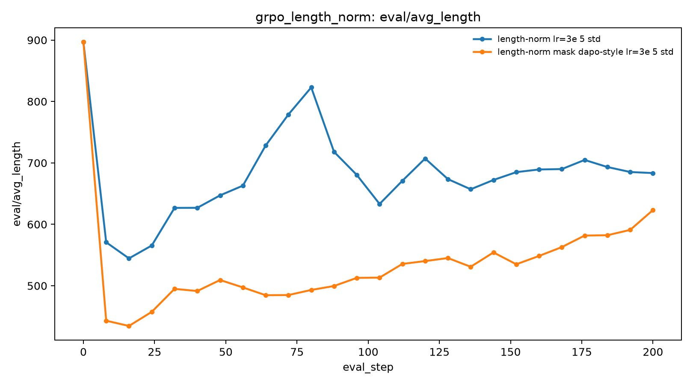

# CS336-LG

[中文](README.zh-CN.md) | English

### From-Scratch LLM Training, Systems Optimization, and Alignment

CS336-LG is a modular implementation of the core engineering pipeline behind modern language models. It covers byte-level tokenization and Transformer pretraining, attention and decoding optimization, scaling-law analysis, pretraining-data filtering, and post-training with SFT, Expert Iteration, and GRPO.

The repository follows the structure of Stanford CS336 while presenting each module as an independently installable and testable project. It is intended for studying implementations, reproducing the included measurements, and extending individual components without requiring the full training artifacts.

## Features

- **Pretraining from first principles:** byte-level BPE, RMSNorm, RoPE, SwiGLU, causal multi-head attention, Transformer LM training, checkpointing, and autoregressive generation.
- **LLM systems optimization:** tiled attention, Triton attention kernels, KV-cache decoding, distributed training primitives, and structured latency/memory benchmarks.
- **Scaling and data pipelines:** public IsoFLOPs fitting plus an auditable web-text filtering pipeline with language, quality, PII, and deduplication stages.
- **Alignment training:** response-only SFT, Expert Iteration, rule-based mathematical rewards, and GRPO-style policy optimization.
- **Reproducible documentation:** module-level environments, tests, runbooks, benchmark tables, controlled ablations, and bilingual documentation.

## Repository Structure

```text
.
├── assignment1-basics/       # Tokenizer, Transformer LM, training and generation
├── assignment2-systems/      # Attention, KV cache, distributed systems and benchmarks
├── assignment3-scaling/      # Public IsoFLOPs scaling-law analysis
├── assignment4-data/         # Pretraining-data extraction and filtering pipeline
└── assignment5-alignment/    # SFT, Expert Iteration, GRPO and evaluation
```

Each module has its own `pyproject.toml` and `uv.lock`. Environments are intentionally isolated because the systems and alignment modules have different CUDA and Python dependency constraints.

## Modules

| Module | Scope | Documentation |
| --- | --- | --- |
| **A1 — Pretraining Basics** | BPE training, tokenizer, Transformer components, AdamW, training loop, evaluation and generation | [README](assignment1-basics/README.md) · [design notes](assignment1-basics/docs/README.md) |
| **A2 — Systems Optimization** | Tiled/Triton attention, KV-cache decoding, DDP, FSDP, optimizer-state sharding and benchmarks | [README](assignment2-systems/README.md) · [design notes](assignment2-systems/docs/README.md) |
| **A3 — Scaling Laws** | Compute-optimal fitting from public IsoFLOPs curves | [README](assignment3-scaling/README.md) · [report](assignment3-scaling/docs/scaling_law_report.md) |
| **A4 — Data Engineering** | HTML/WET extraction, language filtering, PII masking, quality filtering and deduplication | [README](assignment4-data/README.md) · [report](assignment4-data/docs/data_filtering_report.md) |
| **A5 — Alignment** | SFT, Expert Iteration, GRPO, rule-based rewards, rollout and evaluation | [README](assignment5-alignment/README.md) · [design notes](assignment5-alignment/docs/README.md) · [results](assignment5-alignment/docs/results.md) |

## Quick Start

Prerequisites:

- macOS or Linux for CPU-only components;
- Python 3.12 for A1–A4;
- Python 3.11 or 3.12 for A5;
- [uv](https://docs.astral.sh/uv/);
- a CUDA-capable Linux environment for Triton, FlashAttention, vLLM, and GPU benchmarks.

Clone the repository and enter one module at a time:

```bash
git clone https://github.com/linguan0814/CS336-LG.git
cd CS336-LG/assignment1-basics

uv sync
uv run pytest
```

The remaining CPU-compatible modules use the same pattern:

```bash
cd ../assignment2-systems && uv sync && uv run pytest
cd ../assignment3-scaling && uv sync
cd ../assignment4-data && uv sync && uv run pytest
```

A5 should be installed in a CUDA-capable Linux environment because its locked dependencies include FlashAttention and vLLM:

```bash
cd ../assignment5-alignment && uv sync && uv run pytest
```

Some A1/A5 tests inherited from the course setup require local model-weight fixtures. Those weights are intentionally excluded from the public repository; the affected tests and requirements are noted in the corresponding module README.

## Recorded Results

The figures and tables below come from completed runs already recorded in the repository. They were not regenerated during repository packaging. Full conditions and interpretation limits are documented in the linked module reports.

### A1 — Transformer pretraining

The recorded 30k-step run shows held-out validation loss decreasing from approximately 6.8 into the mid-5 range.

<p align="center">
  
</p>

### A2 — Attention baseline

For non-causal float32 attention with batch size 8, sequence length 4096, and `d_model=64`, `torch.compile` produced a recorded **2.26× forward** and **2.28× backward** speedup over eager execution. The PyTorch baseline reached OOM at 16k tokens; at 8k tokens it used approximately 4.10 GiB before backward.

See the [compiled-attention summary](assignment2-systems/benchmark_results/jit_attention/jit_attention_summary_eager_compiled_float32_noncausal.md) and [memory/OOM table](assignment2-systems/benchmark_results/pytorch_attention/pytorch_attention_float32_noncausal.md).

### A5 — Controlled GRPO ablations

Two Math12K experiments isolate advantage standard-deviation normalization and DAPO-style length normalization under matched training settings:

- disabling group standard-deviation normalization: terminal accuracy **48.4% → 61.4%**, accompanied by longer responses;
- using DAPO-style length normalization: terminal accuracy **39.0% → 48.2%**, with lower overall response length.

<p align="center">
  
  
</p>

<p align="center">
  
  
</p>

See [Selected GRPO Results](assignment5-alignment/docs/results.md) for controlled variables, correct/incorrect response lengths, and limitations. SFT and Expert Iteration use a separate GSM8K experiment track and are not treated as direct baselines for these Math12K runs.

## Reproducibility and Artifact Policy

The repository tracks source code, configuration, tests, lightweight public inputs, selected figures, and compact result tables. It intentionally excludes:

- raw datasets and tokenized corpora;
- model weights and checkpoints;
- W&B run directories and exports;
- generated experiment outputs, caches, and logs;
- secrets, local environment files, and machine-specific configuration.

Scripts accept local paths or environment variables where credentials and external artifacts are required. The root `.gitignore` defines the complete publication boundary.

## Contributing

Bug fixes, tests, documentation improvements, and reproducibility fixes are welcome. Changes should keep modules independently runnable, avoid committing generated artifacts, and attach evidence to any new performance or experimental claim.

## License and Attribution

This repository includes work based on Stanford CS336 course structure and starter material. Nested licenses apply to the corresponding modules. Before redistributing or relicensing the repository as a whole, review the upstream course terms and the existing module licenses.
