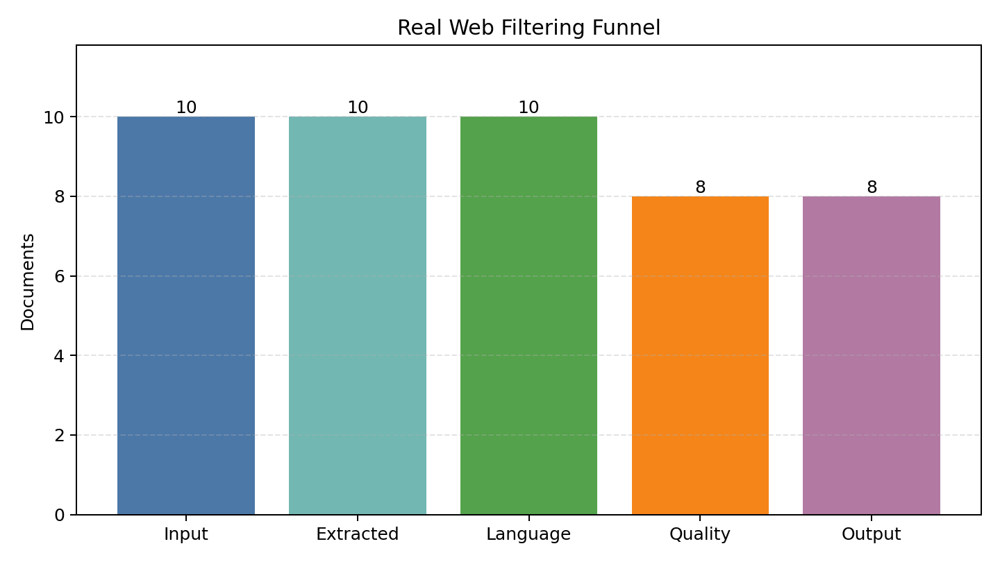
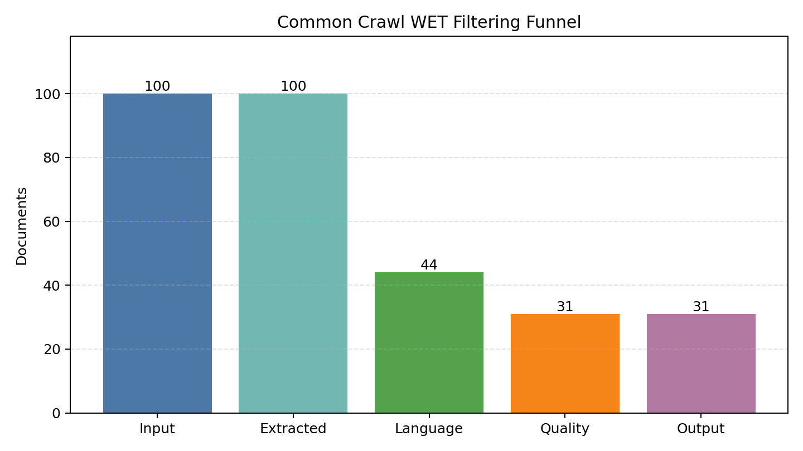
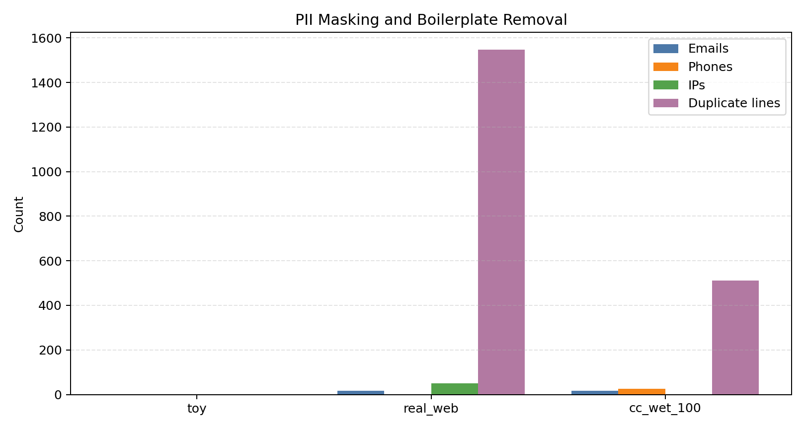
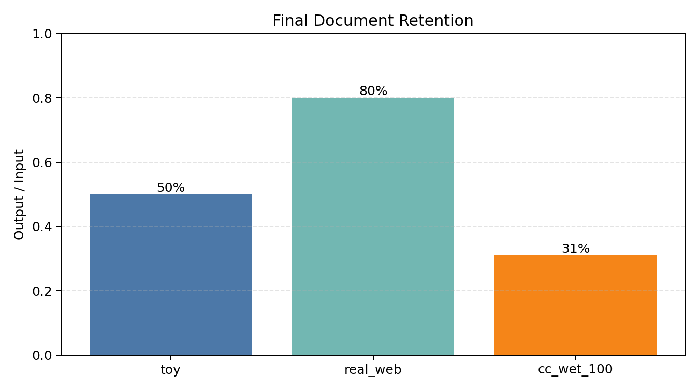

# CS336 Assignment 4: LLM 预训练数据过滤 Pipeline

## 项目概览

这个模块是 CS336-LG 项目中的 **pretraining data engineering** 部分，目标是把 noisy web data 转换成更适合语言模型预训练的 filtered corpus。

和原始作业的 full-scale leaderboard 目标不同，这里采用更适合实习项目展示的范围：实现核心过滤组件，在真实网页和 Common Crawl WET 小样本上跑通，并输出可审计的过滤统计和可视化结果。

## 已实现功能

- **HTML-to-text extraction**：使用 `resiliparse` 从 HTML bytes 中提取正文文本。
- **Language identification**：支持 fastText 模型接口；默认提供英文/中文 deterministic fallback。
- **PII masking**：替换 email、美国常见电话号码、合法 IPv4 地址。
- **Gopher-style quality filtering**：按文档长度、平均词长、ellipsis 行比例、alphabetic word ratio 过滤低质量文本。
- **Exact line deduplication**：移除 corpus-level 重复行，用于去除模板、页脚、导航等 boilerplate。
- **Sample filtering pipeline**：支持 JSONL 输入，输出 cleaned JSONL 和 filtering stats。
- **真实数据验证**：已在真实 public web pages 和 bounded Common Crawl WET sample 上运行。

## Pipeline

```text
Raw HTML / WET text
  -> text extraction
  -> language identification
  -> PII masking
  -> Gopher quality filtering
  -> exact line deduplication
  -> filtered corpus
```

## 使用方式

先进入目录：

```bash
cd assignment4-data
```

运行核心测试：

```bash
uv run pytest -q
```

当前结果：

```text
21 passed
```

运行 toy sample pipeline：

```bash
uv run python scripts/run_filter_pipeline.py \
  --input examples/raw_html_samples.jsonl \
  --output results/filtered_samples.jsonl \
  --stats results/filter_stats.json
```

查看统计：

```bash
uv run python scripts/summarize_filter_stats.py --stats results/filter_stats.json
```

运行真实网页小样本：

```bash
uv run python scripts/fetch_web_pages.py \
  --urls data/real_web_urls.txt \
  --output results/real_raw_html.jsonl \
  --limit 10 \
  --timeout 10 \
  --sleep 0.5

uv run python scripts/run_filter_pipeline.py \
  --input results/real_raw_html.jsonl \
  --output results/real_filtered_samples.jsonl \
  --stats results/real_filter_stats.json
```

详见 `docs/real_data_run.md`。

运行 Common Crawl WET bounded sample：

```bash
uv run python scripts/sample_common_crawl_wet.py \
  --crawl-id CC-MAIN-2026-17 \
  --output results/cc_wet_raw_text_100.jsonl \
  --limit 100 \
  --timeout 30 \
  --min-chars 200

uv run python scripts/run_filter_pipeline.py \
  --input results/cc_wet_raw_text_100.jsonl \
  --output results/cc_wet_filtered_100.jsonl \
  --stats results/cc_wet_filter_stats_100.json
```

详见 `docs/common_crawl_wet_run.md`。

## 实验结果

### Toy sample

| 指标 | 数值 |
| --- | ---: |
| input documents | 4 |
| extracted documents | 4 |
| passed language filter | 3 |
| passed Gopher filter | 2 |
| emails masked | 2 |
| phone numbers masked | 2 |
| IPs masked | 1 |
| duplicate lines removed | 2 |
| output documents | 2 |

输出文件：

- `results/filtered_samples.jsonl`
- `results/filter_stats.json`
- `examples/cleaned_samples.jsonl`

### 真实网页过滤结果

输入为 10 个真实 public web pages，最终保留 8 个文档。

| 指标 | 数值 |
| --- | ---: |
| input pages | 10 |
| extracted pages | 10 |
| passed language filter | 10 |
| passed Gopher filter | 8 |
| emails masked | 17 |
| phone numbers masked | 1 |
| IPs masked | 50 |
| duplicate lines removed | 1548 |
| output documents | 8 |



### Common Crawl WET 小样本过滤结果

输入为 Common Crawl WET 的 100 条文本 records，最终保留 31 个文档。

| 指标 | 数值 |
| --- | ---: |
| input WET records | 100 |
| extracted text records | 100 |
| passed language filter | 44 |
| passed Gopher filter | 31 |
| emails masked | 16 |
| phone numbers masked | 25 |
| IPs masked | 0 |
| duplicate lines removed | 512 |
| output documents | 31 |



### PII masking 与 boilerplate removal

真实网页和 Common Crawl 样本中都能观察到 PII-like pattern 和重复模板文本。Pipeline 会对这些内容做保守处理。



### 不同数据源的保留率

toy sample、真实网页、Common Crawl WET 三组数据的最终保留率如下：



其他结果文件：

- `results/real_raw_html.jsonl`
- `results/real_filtered_samples.jsonl`
- `results/real_filter_stats.json`
- `results/cc_wet_raw_text_100.jsonl`
- `results/cc_wet_filtered_100.jsonl`
- `results/cc_wet_filter_stats_100.json`

图表文件：

- `figures/real_web_filter_funnel.png`
- `figures/cc_wet_filter_funnel.png`
- `figures/pii_and_dedup_counts.png`
- `figures/retention_by_run.png`

生成图表：

```bash
uv run python scripts/plot_filter_stats.py --figures-dir figures
```

## 项目亮点

- 实现了从 raw web text 到 filtered corpus 的完整最小闭环。
- 在真实 public webpages 和 Common Crawl WET sample 上生成了可复现统计。
- 保留了清晰的工程边界：不过度声称 full Common Crawl scale，也不伪装成 production classifier。
- 代码结构简单，核心逻辑位于 `cs336_data/`，测试 adapters 只做 glue code。

## 限制说明

当前模块不是 full-scale Common Crawl processing，也没有进行 leaderboard model training。

- 默认 language ID fallback 是 deterministic heuristic，生产环境应接入 fastText `lid.176.bin`。
- `classify_quality`、`classify_nsfw`、`classify_toxic_speech` 是轻量 placeholder，用于本地测试和 demo，不是生产级分类器。
- 当前 dedup 重点是 exact line deduplication；近似重复和大规模 MinHash/LSH 是 future work。
- WET run 是 bounded sample，不代表完整 Common Crawl 规模。

## 与 CS336-LG 的关系

A4 是 CS336-LG 中的数据工程模块。A3 讨论 compute-optimal token budget，而 A4 回答更实际的问题：**哪些 token 值得进入预训练语料？**

这个模块为后续 A5 的 post-training / alignment 数据处理提供了自然衔接。
